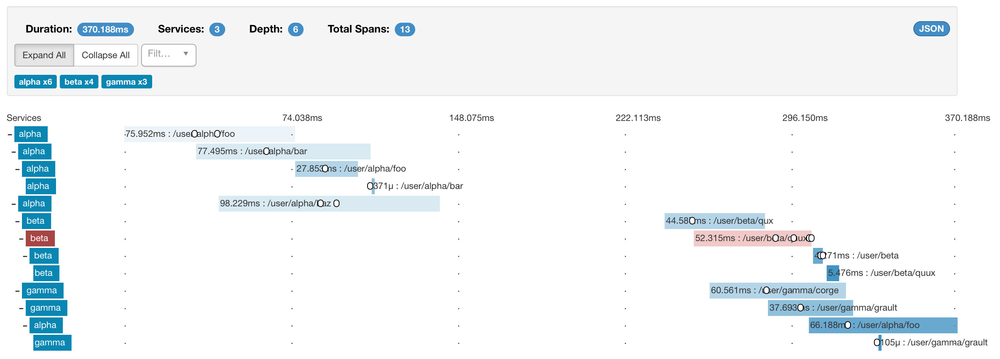

# Cinnamon Akka tracing sample

Sample project for tracing through multiple Akka nodes and actors, to produce a trace similar to the examples in this [blog post about Cinnamon and OpenTracing][cinnamon-opentracing].

[cinnamon-opentracing]: https://developer.lightbend.com/blog/2017-05-08-cinnamon-2-4-with-opentracing-integration/


## Credentials file

First make sure you have credentials set up for Lightbend Reactive Platform. You can find your username and password under your [Lightbend account].

Create a `~/.lightbend/commercial.credentials` file with:

```
realm = Bintray
host = dl.bintray.com
user = <username>
password = <password>
```

[Lightbend account]: https://www.lightbend.com/product/lightbend-reactive-platform/credentials


## Running the sample

Start up Zipkin standalone:

```
docker run -d --name zipkin -p 9411:9411 openzipkin/zipkin
```

Run the sample:

```
sbt run
```

Traces will be reported to Zipkin at:

[http://localhost:9411/zipkin/](http://localhost:9411/zipkin/)

Here's an example trace:


